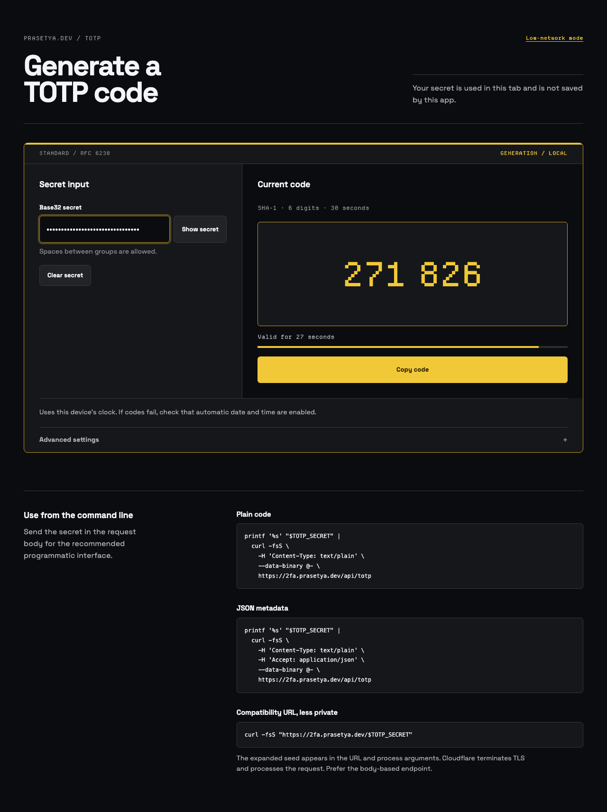
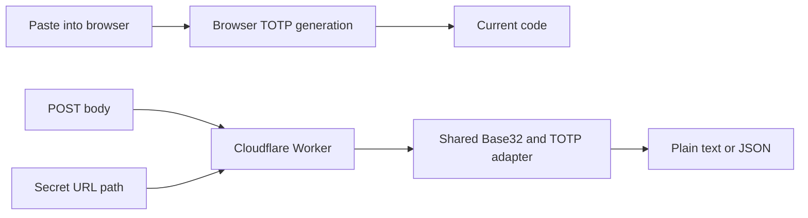

<p align="center">
  
</p>

# 2FA TOTP Generator

[](https://github.com/andhikapraa/2fa-seeker/actions/workflows/ci.yml)
[](LICENSE)
[](https://2fa.prasetya.dev)

Generate RFC-compliant TOTP codes in a browser or from `curl`, with explicit boundaries around where your secret goes.

[Open the live app](https://2fa.prasetya.dev) · [Try low-network mode](https://2fa.prasetya.dev/slow) · [Load the 1 kB mode](https://2fa.prasetya.dev/1k) · [Report a vulnerability](SECURITY.md)



## Why this project exists

TOTP tools often hide the most important fact: whether the credential stays on your device or is sent to a server. This project makes that boundary visible.

- Browser paste flows generate codes locally.
- The API accepts secrets in the request body rather than the URL.
- A direct URL interface exists for compatibility, but is deliberately marked less private.
- No analytics, cookies, browser storage, third-party scripts, or custom request logging.
- HOTP, TOTP, and Base32 behavior is tested against RFC 4226, RFC 6238, and RFC 4648 vectors.

## Choose the right mode

| Surface | Where the secret is processed | Best for |
| --- | --- | --- |
| [`/`](https://2fa.prasetya.dev) | Your browser tab | Full interface, advanced parameters, copy and clear controls |
| [`/slow`](https://2fa.prasetya.dev/slow) | Your browser tab | Low-bandwidth use with fixed SHA-1, 6-digit, 30-second settings |
| [`/1k`](https://2fa.prasetya.dev/1k) | Your browser tab | One self-contained request with fixed settings and no secondary controls |
| `POST /api/totp` | The Cloudflare Worker | Recommended command-line and programmatic interface |
| `GET /s/<BASE32_SECRET>` | URL path, Cloudflare Worker, browser history and process arguments | Display-only HTML with one large code and automatic refresh at rollover; less private |
| `GET /<BASE32_SECRET>` | URL path, Cloudflare Worker, browser history and process arguments | Compatibility only; less private |

Browser-local does not mean that every surrounding system is trusted. Browser extensions, screenshots, the clipboard, and the device itself remain outside this application's control.

## Quick start

### Browser

Open [2fa.prasetya.dev](https://2fa.prasetya.dev), paste a Base32 secret, and generate the code. The root form prevents submission and performs generation in the tab.

### Command line

Keep the secret in the request body:

```bash
printf '%s' "$TOTP_SECRET" |
  curl -fsS \
    -H 'Content-Type: text/plain' \
    --data-binary @- \
    https://2fa.prasetya.dev/api/totp
```

The plain response is exactly one code followed by a newline.

Request JSON metadata:

```bash
printf '%s' "$TOTP_SECRET" |
  curl -fsS \
    -H 'Content-Type: text/plain' \
    -H 'Accept: application/json' \
    --data-binary @- \
    https://2fa.prasetya.dev/api/totp
```

JSON responses contain:

```json
{
  "code": "123456",
  "algorithm": "SHA1",
  "digits": 6,
  "period": 30,
  "generated_at": "2026-07-22T12:00:00Z",
  "valid_until": "2026-07-22T12:00:30Z",
  "seconds_remaining": 30
}
```

The JSON request form also accepts `algorithm` (`SHA1`, `SHA256`, or `SHA512`), `digits` (`6` or `8`), and `period` (`1` through `3600` seconds).

```bash
curl -fsS \
  -H 'Content-Type: application/json' \
  -H 'Accept: application/json' \
  --data '{"secret":"'"$TOTP_SECRET"'","algorithm":"SHA256","digits":8,"period":60}' \
  https://2fa.prasetya.dev/api/totp
```

The compatibility URL is intentionally not recommended:

```bash
curl -fsS "https://2fa.prasetya.dev/$TOTP_SECRET"
```

That form exposes the expanded secret in the URL, shell process arguments, and infrastructure that handles the request.

For a display-only browser page with no CSS or JavaScript:

```text
https://2fa.prasetya.dev/s/<BASE32_SECRET>
```

The response contains only hidden refresh metadata and a single `<h1>` with the current code. It has the same URL-exposure risks as the compatibility route.

## Security model

The project minimizes credential exposure; it does not promise zero knowledge or complete erasure.

### Browser paste flows

- Parse and validate Base32 locally.
- Generate TOTP codes locally.
- Do not send the pasted secret after page load.
- Do not persist the secret in `localStorage`, `sessionStorage`, IndexedDB, cookies, or a service worker.

### Worker flows

- `POST /api/totp` sends the secret to Cloudflare in the request body.
- `GET /<secret>` sends it in the URL path and is less private.
- Responses use `Cache-Control: no-store`, `Referrer-Policy: no-referrer`, strict CSP, framing protection, and no permissive CORS.
- The Worker does not define custom request logging or application storage.

Do not include a real TOTP secret in issues, pull requests, screenshots, logs, or vulnerability reports. Use published RFC test vectors only. See [SECURITY.md](SECURITY.md) for private reporting.

## Architecture



The full and slow interfaces share the TypeScript TOTP adapter with the Worker. The 1 kB route uses native Web Crypto in one self-contained document.

## Development

Requirements:

- [Bun](https://bun.sh/) 1.3.14 or newer
- A modern browser
- Cloudflare authentication only for remote development or deployment

Install dependencies:

```bash
bun install --frozen-lockfile
```

Run the browser interface with Vite:

```bash
bun run dev
```

Run the complete Worker and static-asset surface:

```bash
bun run dev:worker
```

Verify the project:

```bash
bun run check
bun run test
bun run build
```

The test suite covers published RFC vectors, Base32 edge cases, TOTP parameter validation, content negotiation, route behavior, body limits, and security headers.

## Deploy a fork

The default `wrangler.jsonc` is fork-safe: it deploys to the authenticated contributor's Workers account and does not claim the official custom domain.

```bash
bun run deploy:dry
bun run deploy
```

Authenticate with `wrangler login` or provide `CLOUDFLARE_ACCOUNT_ID` and `CLOUDFLARE_API_TOKEN` through your environment. Never commit those values.

The official site uses `wrangler.production.jsonc` and is deployed manually by the maintainer:

```bash
bun run deploy:production:dry
bun run deploy:production
```

Pull requests never receive production deployment credentials and do not deploy the official hostname.

## Project documentation

- [Product principles](PRODUCT.md)
- [Changelog](CHANGELOG.md)
- [Design system](DESIGN.md)
- [Contribution guide](CONTRIBUTING.md)
- [Security policy](SECURITY.md)
- [Maintainer release guide](docs/maintainer-guide.md)
- [Third-party notices](THIRD_PARTY_NOTICES.md)

## Contributing

Bug fixes, standards corrections, accessibility improvements, and focused interface improvements are welcome. Read [CONTRIBUTING.md](CONTRIBUTING.md) before opening a pull request.

For security vulnerabilities, use the private process in [SECURITY.md](SECURITY.md), not a public issue.

## License

Source code is licensed under the [Apache License 2.0](LICENSE). Bundled runtime dependencies retain their MIT notices, and bundled fonts remain under the SIL Open Font License 1.1; see [THIRD_PARTY_NOTICES.md](THIRD_PARTY_NOTICES.md), [`public/THIRD_PARTY_NOTICES.txt`](public/THIRD_PARTY_NOTICES.txt), and [`public/fonts/LICENSE.txt`](public/fonts/LICENSE.txt).
